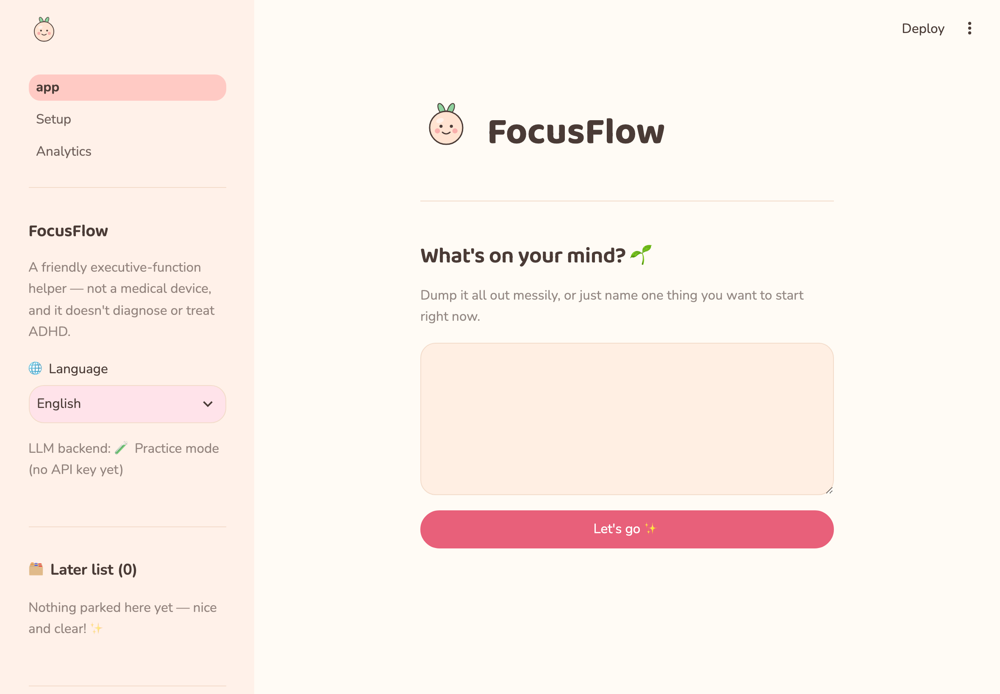
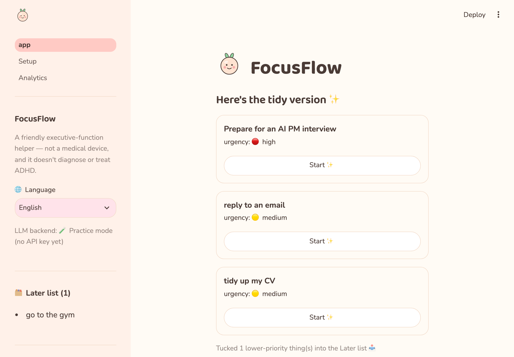
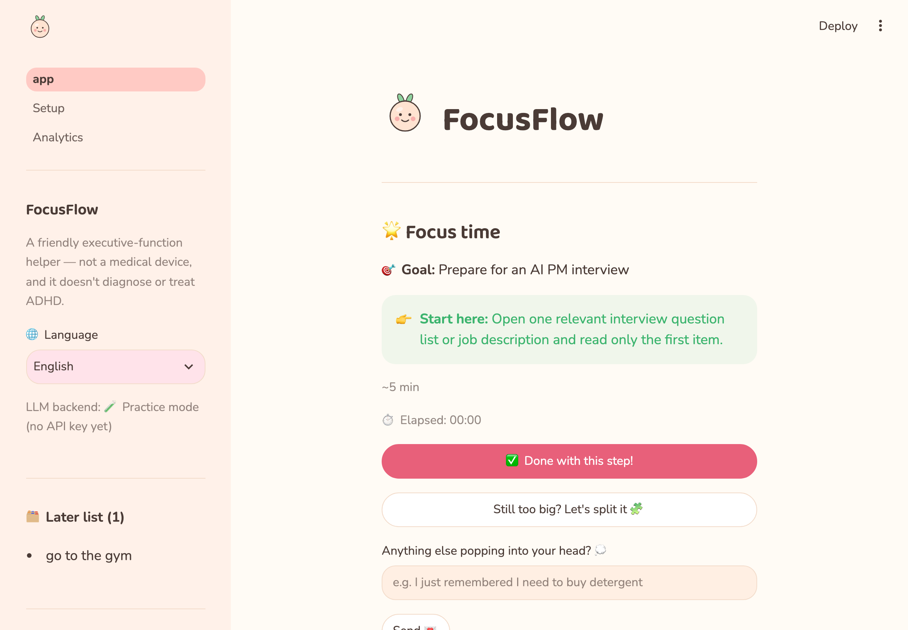
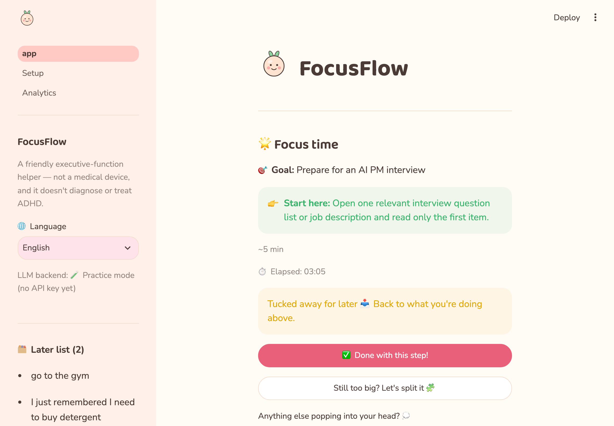
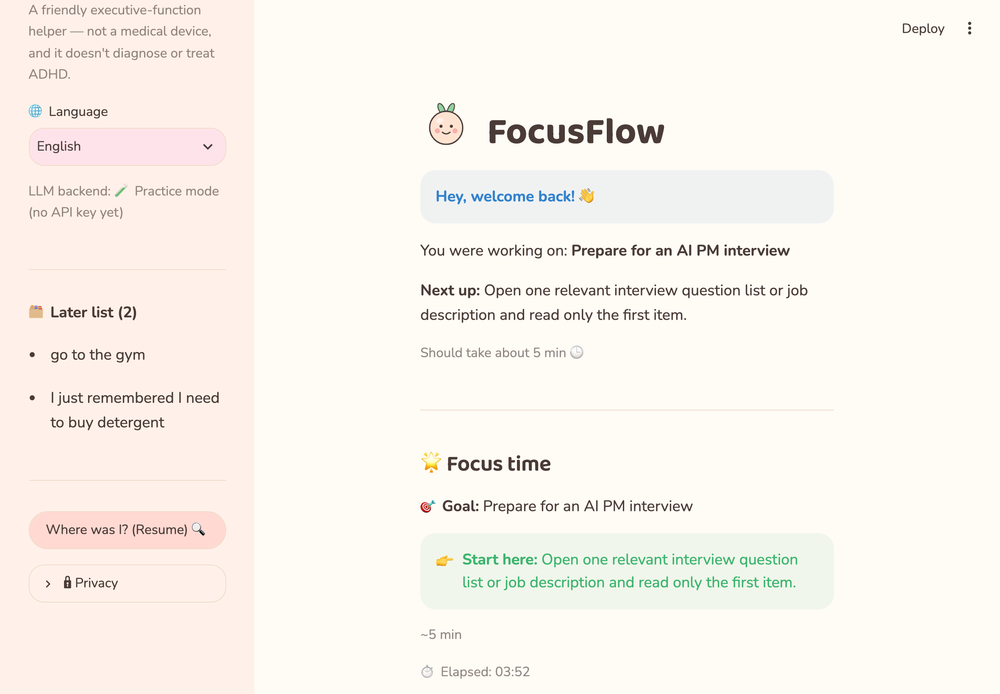
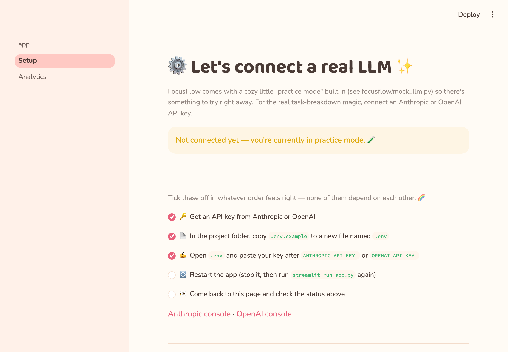
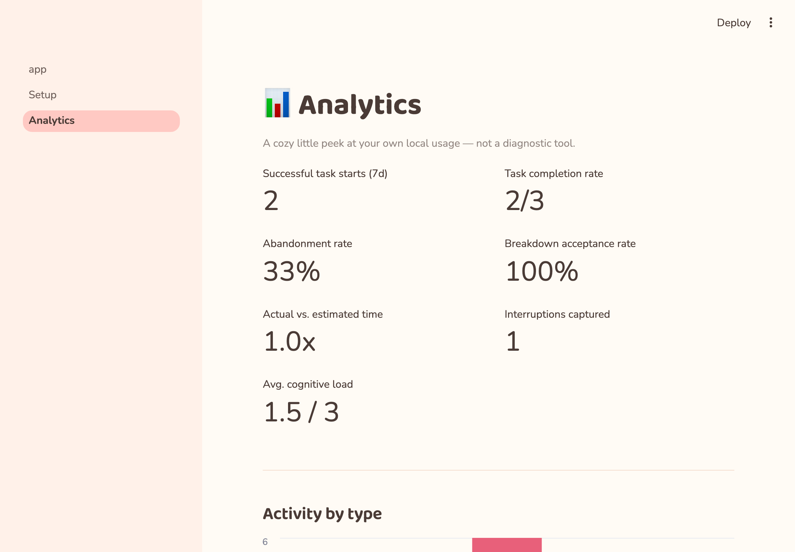

<p align="center">
  
</p>
<h1 align="center">FocusFlow</h1>
<p align="center"><em>An AI executive-function assistant for ADHD-style task-initiation friction — a small, deliberately non-autonomous LangGraph workflow, not a chatbot with a to-do list bolted on.</em></p>

<p align="center">
  <a href="https://github.com/anyan001121-dot/focusflow/actions/workflows/tests.yml"></a>
  
  <a href="LICENSE"></a>
</p>

<p align="center">
  <a href="https://focusflow-j2gkquxeg2cifcxmyqxw8w.streamlit.app/"><strong>Try it live → / 在线试用 →</strong></a>　(practice mode, no signup — see <a href="#connecting-a-real-llm">Connecting a real LLM</a> / <a href="#接入真实-llm">接入真实 LLM</a>)
</p>

<p align="center"><strong><a href="#english">English</a> · <a href="#中文">中文</a></strong></p>

---

## English

### tl;dr

- FocusFlow closes the gap between *"I know what I need to do"* and *"I can actually start."* It is not a to-do app and not a medical device.
- Messy thoughts in → at most 3 priorities out. A vague goal in → one concrete step you can start in 2-5 minutes. Get distracted mid-task → the new thought is parked, not adopted, and you're handed straight back to what you were doing.
- Try it in under a minute, no API key required:
  ```bash
  pip install -r requirements.txt && streamlit run app.py
  ```



### The problem

Most task-initiation friction isn't a planning problem, it's a *first-step* problem. Someone with ADHD (or just an overloaded week) usually knows the shape of what needs doing — the blocker is that "prepare for an interview" doesn't have an obvious verb attached to it, and a wall of unsorted thoughts is itself exhausting to look at.

Generic to-do apps make this worse: they reward capturing more, not starting sooner. FocusFlow is built around one constraint instead: **don't maximize information — minimize the cognitive effort required to take the next useful action.** Concretely, it targets four failure modes:

| Failure mode | What FocusFlow does about it |
|---|---|
| Cognitive overload from unsorted thoughts | Brain Dump caps output at 3 priorities, parks the rest |
| Abstract goals never get started | Breakdown always returns one 2-5 min first step, never a plan |
| A new thought derails the current task | Focus Mode parks it in a Later list instead of switching tasks |
| Coming back after an interruption is disorienting | Resume shows only done / current / next — not the whole project |

### What it does

**Brain Dump** — dump everything messily; get back at most three clear priorities, with the rest quietly parked.



**Focus Mode** — one goal, one step, a live elapsed-time readout, and a "still too big" escape hatch that re-breaks the current step instead of giving up on it.



**Interruption capture** — a new thought mid-task gets filed to Later without touching the active step.



**Resume** — coming back shows only what's done, what's current, and what's next.



### Design decisions

A few things worth knowing about how this actually behaves, since they shape what you can expect from it day to day:

**1. It can reason about an interruption, but it can't argue its way into abandoning your task.** When you say something new mid-task, FocusFlow doesn't just run a rigid script — the model actually looks at what you're doing and what you just said, and picks between a few responses, including, if it genuinely thinks your new message is more urgent, proposing to drop your current task and switch. That proposal always has to clear a separate check (`focusflow/policy.py`) first, and while you're in Focus Mode, "switch tasks" simply isn't on the list of things it's allowed to do — no matter how it argues for it. There's a test ([`test_policy_blocks_agent_even_when_it_insists_on_switching_tasks`](tests/test_graph.py)) that forces the model to insist on switching anyway, just to make sure the answer holds. So you get real judgment on the small stuff, with a hard floor under the one promise that actually matters: it won't abandon what you're doing.

**2. The numbers it shows you aren't an afterthought.** From the first version, every turn you take has been logged, and FocusFlow has been quietly checking whether its time estimates match how long things actually took you, and whether you end up accepting or asking to re-split the steps it suggests. That's what's behind the Analytics page you can open yourself — see [Evaluation](#evaluation) below.

**3. You can see how it actually behaves before you commit to an API key.** A built-in fallback (`focusflow/mock_llm.py`) handles brain dump, breakdown, and interruptions on its own, at lower quality than a real model, but well enough that you can judge the whole loop within thirty seconds of opening it — no signup required first.

**4. It learns your pace from two numbers, not a black box.** The more you use it, the more it notices whether you tend to run over your estimates and whether you keep asking for smaller steps — and it leans on that the next time it breaks something down for you. No hidden model retraining on your data, just two plain running averages doing a job that doesn't need more than that.

**5. Your history sticks around locally; a shared copy keeps everyone separate.** Run this for yourself, and your state survives closing the app and coming back — that's what Resume is for. If someone deploys a public copy for strangers to try, one setting (`FOCUSFLOW_MULTI_SESSION=true`) keeps every visitor's data apart instead of everyone reading and writing the same profile. Either way, you get the behavior that matches how you're actually using it.

**6. If the LLM it's talking to has a bad moment, you won't see a crash.** A timeout, a rate limit, a response that doesn't parse — any of that gets caught, logged quietly, and FocusFlow falls back to the same offline suggestion you'd get with no API key at all. A tool whose whole pitch is staying calm shouldn't be the one handing you a stack trace.

<details>
<summary><strong>Architecture</strong> (click to expand)</summary>

```
User Input
    |
Intent Router
    |
    +---------------+---------------+----------------+
    |               |               |                |
Brain Dump       New Task        Resume         Interruption
    |               |               |                |
Organize        Breakdown      Load State        Capture
    |               |               |                |
Prioritize     Next Action     Resume Point      Later List
    +---------------+---------------+----------------+
                     |
                Focus Mode
                     |
                Task State (SQLite)
                     |
               User Progress
```

Implemented with [LangGraph](https://github.com/langchain-ai/langgraph) as a small, controlled state machine (`focusflow/graph.py`). State persists locally in SQLite (`focusflow/db.py`).

| Layer | File |
|---|---|
| Shared state schema | `focusflow/state.py` |
| Router + nodes (LangGraph) | `focusflow/graph.py` |
| Bounded-agency policy engine | `focusflow/policy.py` |
| DB + graph orchestration, personalization | `focusflow/service.py` |
| LLM provider wrapper | `focusflow/llm.py`, `focusflow/mock_llm.py` |
| Prompts | `focusflow/prompts.py` |
| Persistence (state, events, preferences) | `focusflow/db.py` |
| UI strings (EN/中文) | `focusflow/i18n.py` |
| Main UI | `app.py` (Streamlit) |
| Setup checklist | `pages/0_Setup.py` |
| Analytics dashboard | `pages/1_Analytics.py` |

</details>

<details>
<summary><strong>Tech stack</strong></summary>

Python · [Streamlit](https://streamlit.io) (UI) · [LangGraph](https://github.com/langchain-ai/langgraph) (orchestration) · SQLite (persistence) · Anthropic / OpenAI APIs, with a heuristic offline fallback · pytest + Streamlit `AppTest` (headless UI testing) · GitHub Actions (CI)

</details>

### More screens



Setup is a real, persistent, order-independent checklist (`pages/0_Setup.py`) — deliberately not a linear wizard, per the same "don't force a sequence" principle the product applies to tasks.



### Evaluation

Product quality here is judged on usage outcomes, not on whether responses "sound good" (PRD requirement, not an afterthought). Every turn is logged to a local `events` table; the Analytics page (`pages/1_Analytics.py`) surfaces:

- Task Start Rate, Time-to-Start, Task Completion Rate
- Breakdown Acceptance Rate, Resume Success Rate, Abandonment Rate
- Cognitive Load (self-reported, one tap after each completed task)
- North Star: **Successful Task Starts per User per Week**

### Roadmap

- **V0.1** (done): Brain Dump → Task Extraction → Breakdown → Prioritization → One Next Action.
- **V0.2** (done): LangGraph workflow, Focus Mode, interruption capture, Later list, Resume, SQLite persistence.
- **V0.3** (partial): done — Focus Timer, step-splitting, long-term preference memory, adaptive breakdown, Analytics dashboard. Not done — calendar integration.

### Tests

```bash
pip install -r requirements.txt
pytest
```

24 tests, three layers: pure graph-logic tests against the mock LLM (no API key needed), SQLite persistence tests, and headless Streamlit `AppTest` runs that click through the real UI (brain dump → start → split → done, language switch, privacy reset) to catch widget-wiring bugs that unit tests miss. CI runs the full suite on every push against Python 3.11 and 3.13 (see the badge above).

### Connecting a real LLM

FocusFlow works with **no API key** (heuristic mock backend). These steps are independent — do them in any order:

- [ ] Get an API key: [Anthropic console](https://console.anthropic.com/settings/keys) or [OpenAI console](https://platform.openai.com/api-keys).
- [ ] Copy `.env.example` to a new file named `.env` in the project root.
- [ ] Open `.env` and paste your key after `ANTHROPIC_API_KEY=` or `OPENAI_API_KEY=` (Anthropic is used if both are set).
- [ ] Restart the app: stop it and run `streamlit run app.py` again.
- [ ] Check the sidebar's "LLM backend" line, or the in-app **Setup** page, for a live connection status.

### Deploying your own copy

Deploying to something like [Streamlit Community Cloud](https://share.streamlit.io) works out of the box (point it at this repo, main file `app.py`). One setting matters if more than one person will use the same deployed instance at once:

```
FOCUSFLOW_MULTI_SESSION=true
```

Without it, every visitor to a shared deployment reads and writes the same local-profile row — fine for your own single-user instance, not fine for a public demo with concurrent strangers. See [Design decisions](#design-decisions) point 5.

### Privacy & safety

- Not a medical device: no ADHD diagnosis, no medication advice, no replacement for professional care.
- All data stays in one local SQLite file (`focusflow.db` by default, gitignored).
- "Delete all my data" in the app (or `service.reset_all()`) wipes stored state and event history at any time.

### License

[MIT](LICENSE)

---

## 中文

### 一句话版

- FocusFlow 想缩小"我知道要做什么"和"我真的能开始做"之间的差距。它不是待办事项应用，也不是医疗设备。
- 杂乱的想法丢进去 → 最多给你 3 个优先事项。模糊的目标丢进去 → 给你一个 2-5 分钟就能开始的具体动作。做到一半分心了 → 新想法被记下来，不会取代你正在做的事，随时能被原样接回去。
- 一分钟内跑起来，不需要任何 API key：
  ```bash
  pip install -r requirements.txt && streamlit run app.py
  ```


### 要解决的问题

大部分"启动困难"其实不是规划问题，而是"第一步"问题。ADHD（或者只是这周太满）的人通常知道大概要做什么——卡住的地方是"准备面试"这四个字没有一个明确的动词，而一堆没整理的想法本身看着就很累。

普通的待办事项应用只会让这更糟：它们奖励"记录更多"，而不是"更快开始"。FocusFlow 的设计只围绕一个约束：**不追求信息最大化，而是把"采取下一步有用行动"所需的认知负担降到最低。** 具体针对四类失败场景：

| 失败场景 | FocusFlow 的应对 |
|---|---|
| 一堆没整理的想法带来认知过载 | Brain Dump 最多输出 3 个优先事项，其余悄悄放进稍后列表 |
| 抽象目标永远无法开始 | 拆解永远给一个 2-5 分钟的第一步，不给完整计划 |
| 新想法打断当前任务 | 专注模式把它记进稍后列表，而不是切换任务 |
| 打断后回来无所适从 | 恢复功能只展示"完成/当前/下一步"，不是整个项目 |

### 它能做什么

**Brain Dump**——随意倒出所有想法，拿回最多三个清晰的优先事项，其余安静地放进稍后列表。


**专注模式**——一个目标、一个步骤、实时显示已用时间，"还是太大了"按钮可以重新拆解当前步骤而不是放弃它。


**打断捕获**——任务进行中冒出的新想法会被记进稍后列表，不会碰到正在进行的步骤。


**恢复**——回来的时候只看到完成了什么、现在在做什么、下一步是什么。


### 设计决策

有几件事知道了会让你更明白这东西平时是怎么表现的：

**1. 它能对打断做出真正的判断，但没法说服自己放弃你的任务。** 你在做任务的时候突然说了点别的，FocusFlow 不是照着死板的脚本走——模型是真的会看你在做什么、你刚说了什么，然后从几个反应里选一个，如果它觉得你说的事真的更紧急，甚至会提议放下手头的任务切换过去。但这个提议永远要先过一道关卡（`focusflow/policy.py`），只要你还在专注模式里，"切换任务"压根不在它能选的范围内——不管它怎么找理由都没用。仓库里有个测试（[`test_policy_blocks_agent_even_when_it_insists_on_switching_tasks`](tests/test_graph.py)）专门逼着模型坚持要切换，就是为了确认这条底线不会松动。所以你拿到的是：小事上它真的会判断，但唯一那条最重要的承诺——不会把你正在做的事丢下——焊死了。

**2. 你看到的那些数字不是事后补的。** 从第一版起，你的每一轮操作都会被记下来，FocusFlow 一直在悄悄检查它给的时间预估跟你实际花的时间对不对得上、你有没有接受它拆出来的步骤（还是要求再拆一次）。这些就是你自己能打开的 Analytics 页面背后的数据来源——详见下面的"评估指标"。

**3. 不用先申请 API key，你就能看到它到底怎么运作。** 内置的一个后备方案（`focusflow/mock_llm.py`）自己就能把 brain dump、拆解、打断这一整套跑起来，质量比不上真模型，但足够让你打开的头 30 秒内看懂整个流程——不用先注册什么。

**4. 它靠两个数字了解你的节奏，不是靠黑箱。** 你用得越多，它越会留意你是不是经常超出预估时间、是不是老要求把步骤拆得更小——下次给你拆任务时就会照着这个调整。没有什么在后台悄悄用你的数据训练模型，就两个很朴素的滚动平均数，干的活也不需要更复杂的东西。

**5. 你自己用，记录会一直留着；如果是公开分享的版本，每个人的数据会分开。** 你自己在本地跑，关掉再打开，记录还在——这就是"恢复"这个功能的意义。如果有人把它部署成一个给陌生人试用的公开版本，只要开一个设置（`FOCUSFLOW_MULTI_SESSION=true`），每个访客的数据就会分开，不会互相读到对方的东西。不管哪种情况，你拿到的行为都会跟你实际的使用场景对上。

**6. 就算它连的那个 LLM 状态不好，你也不会看到报错。** 超时、被限流、返回的内容解析不出来——这些情况都会被接住，安静地记一条日志，然后 FocusFlow 会退回成跟没配 API key 时一样的建议。一个卖点是"让你保持冷静"的工具，不该自己先甩一个报错堆栈给你看。

<details>
<summary><strong>架构</strong>（点击展开）</summary>

```
用户输入
    |
意图路由 Intent Router
    |
    +---------------+---------------+----------------+
    |               |               |                |
Brain Dump       新任务          Resume           打断
    |               |               |                |
整理            拆解           加载状态          捕获
    |               |               |                |
排优先级        下一步动作       恢复要点          稍后列表
    +---------------+---------------+----------------+
                     |
                专注模式 Focus Mode
                     |
                任务状态（SQLite）
                     |
               用户进度
```

用 [LangGraph](https://github.com/langchain-ai/langgraph) 实现为一个小而受控的状态机（`focusflow/graph.py`）。状态本地持久化在 SQLite（`focusflow/db.py`）中。

| 层 | 文件 |
|---|---|
| 共享状态结构 | `focusflow/state.py` |
| 路由 + 节点（LangGraph） | `focusflow/graph.py` |
| 有边界的 Agent 策略引擎 | `focusflow/policy.py` |
| 数据库 + 图编排、个性化 | `focusflow/service.py` |
| LLM provider 封装 | `focusflow/llm.py`, `focusflow/mock_llm.py` |
| 提示词 | `focusflow/prompts.py` |
| 持久化（状态、事件、偏好） | `focusflow/db.py` |
| 界面文案（中/英） | `focusflow/i18n.py` |
| 主界面 | `app.py`（Streamlit） |
| 设置 checklist | `pages/0_Setup.py` |
| 分析看板 | `pages/1_Analytics.py` |

</details>

<details>
<summary><strong>技术栈</strong></summary>

Python · [Streamlit](https://streamlit.io)（界面）· [LangGraph](https://github.com/langchain-ai/langgraph)（编排）· SQLite（持久化）· Anthropic / OpenAI API，带启发式离线回退 · pytest + Streamlit `AppTest`（无浏览器界面测试）· GitHub Actions（CI）

</details>

### 更多界面


Setup 是一个真实的、会持久化的、不分先后顺序的 checklist（`pages/0_Setup.py`）——刻意没有做成线性向导，和这个产品"不强迫顺序"的核心原则一致。


### 评估指标

产品质量在这里靠使用效果来判断，而不是"回复听起来好不好"（这是需求文档里写明的要求，不是事后补的）。每一轮交互都会记录到本地的 `events` 表，Analytics 页面（`pages/1_Analytics.py`）呈现：

- 任务启动率、启动耗时、任务完成率
- 拆解接受率、恢复成功率、放弃率
- 认知负荷（每次任务完成后一次自评点击）
- 北极星指标：**每位用户每周成功启动任务的次数**

### 路线图

- **V0.1**（已完成）：Brain Dump → 任务提取 → 拆解 → 排优先级 → 一个下一步动作。
- **V0.2**（已完成）：LangGraph 工作流、专注模式、打断捕获、稍后列表、恢复、SQLite 持久化。
- **V0.3**（部分完成）：已完成——专注计时器、步骤再拆分、长期偏好记忆、自适应拆解、分析看板。未完成——日历集成。

### 测试

```bash
pip install -r requirements.txt
pytest
```

24 个测试，三个层次：针对 mock LLM 的纯图逻辑测试（不需要 API key）、SQLite 持久化测试，以及无浏览器的 Streamlit `AppTest`，会真的点击走一遍界面（brain dump → 开始 → 拆分 → 完成、切换语言、清空隐私数据），用来抓单元测试抓不到的控件接线问题。CI 在每次 push 时对 Python 3.11 和 3.13 跑全套测试（见上方徽章）。

### 接入真实 LLM

FocusFlow **不需要任何 API key** 也能跑（启发式 mock 后端）。以下步骤彼此独立，按任意顺序完成：

- [ ] 申请一个 API key：[Anthropic 控制台](https://console.anthropic.com/settings/keys) 或 [OpenAI 控制台](https://platform.openai.com/api-keys)。
- [ ] 把项目根目录的 `.env.example` 复制一份，命名为 `.env`。
- [ ] 打开 `.env`，把你的 key 粘贴到 `ANTHROPIC_API_KEY=` 或 `OPENAI_API_KEY=` 后面（两个都填时优先用 Anthropic）。
- [ ] 重启应用：停掉后重新运行 `streamlit run app.py`。
- [ ] 看侧边栏的 "LLM backend" 那一行，或者应用内的 **Setup** 页面，会实时显示连接状态。

### 部署自己的版本

部署到 [Streamlit Community Cloud](https://share.streamlit.io) 这类平台开箱即用（指向这个仓库，主文件填 `app.py`）。如果会有不止一个人同时用同一个部署实例，有一个设置很重要：

```
FOCUSFLOW_MULTI_SESSION=true
```

不设这个的话，共享部署的每个访问者都会读写同一行"本地档案"数据——自己一个人用没问题，公开 demo 有多个陌生人同时访问就不行了。详见"设计决策"第 5 条。

### 隐私与安全

- 不是医疗设备：不做 ADHD 诊断、不提供用药建议、不能替代专业医疗意见。
- 所有数据都保存在本地单个 SQLite 文件中（默认 `focusflow.db`，已加入 `.gitignore`）。
- 应用内的"删除我的所有数据"（或调用 `service.reset_all()`）可以随时清空已存储的状态和事件历史。

### 许可证

[MIT](LICENSE)
